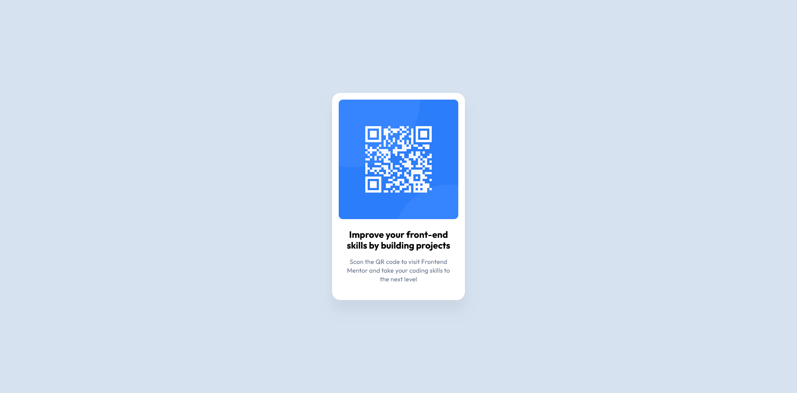

# Frontend Mentor - QR code component solution

This is a solution to the [QR code component challenge on Frontend Mentor](https://www.frontendmentor.io/challenges/qr-code-component-iux_sIO_H). Frontend Mentor challenges help you improve your coding skills by building realistic projects. 

## Table of contents

- [Overview](#overview)
  - [Screenshot](#screenshot)
  - [Links](#links)
- [My process](#my-process)
  - [Built with](#built-with)
  - [Useful resources](#useful-resources)
- [Author](#author)
- [Acknowledgments](#acknowledgments)

## Overview

### Screenshot

### Links

- Solution URL: [Solution URL](https://github.com/abdirahim88/qr-code-template)
- Live Site URL: [Live Site URL](https://abdirahim88.github.io/qr-code-template/)

## My process

### Built with

- Semantic HTML5 markup
- CSS custom properties
- Flexbox
- Mobile-first workflow
- [tailwidcss](https://tailwindcss.com/) - JS library

## Author

- Website - [kaafi tech](https://www.kaafitech.com)
- Frontend Mentor - [@abdirahim](https://www.frontendmentor.io/profile/abdirahim88)
- Twitter - [@abdirahimali](https://www.twitter.com/abdirahimali)

## Acknowledgments

Thanks frontend mentor team 
